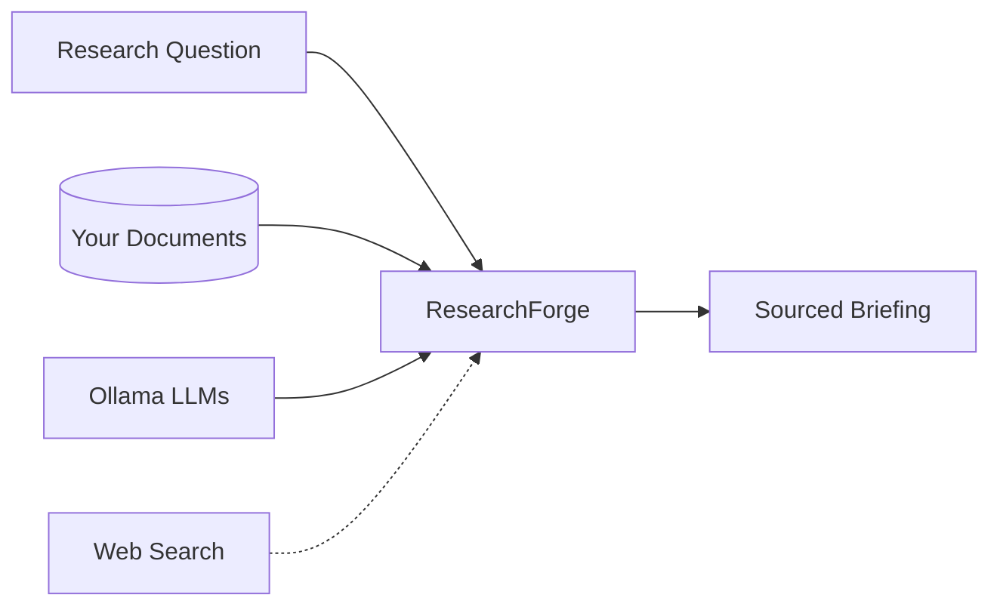
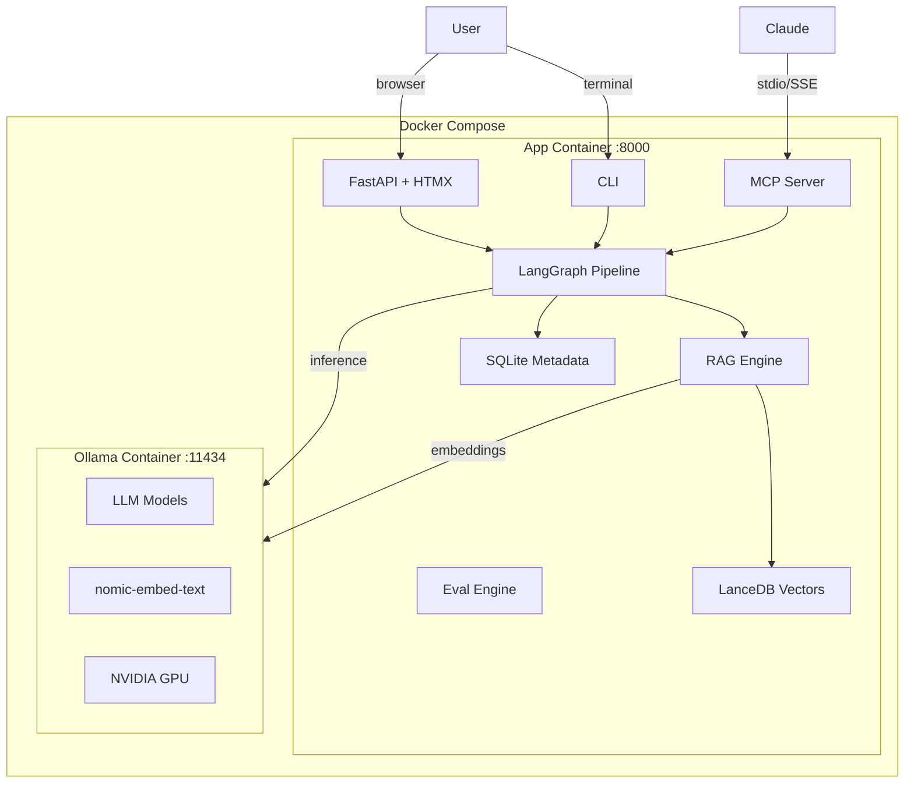
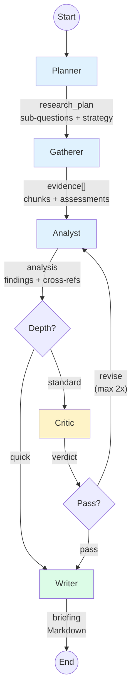
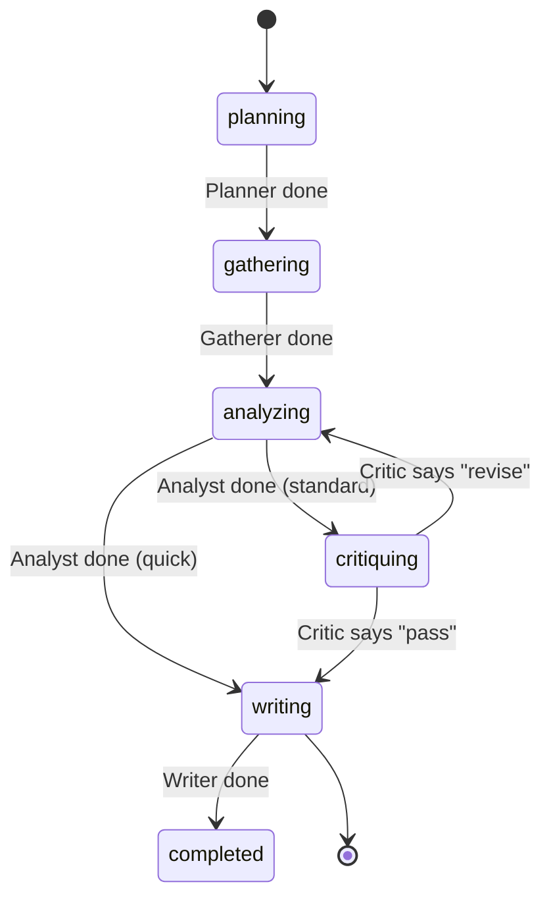
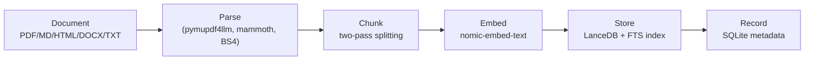
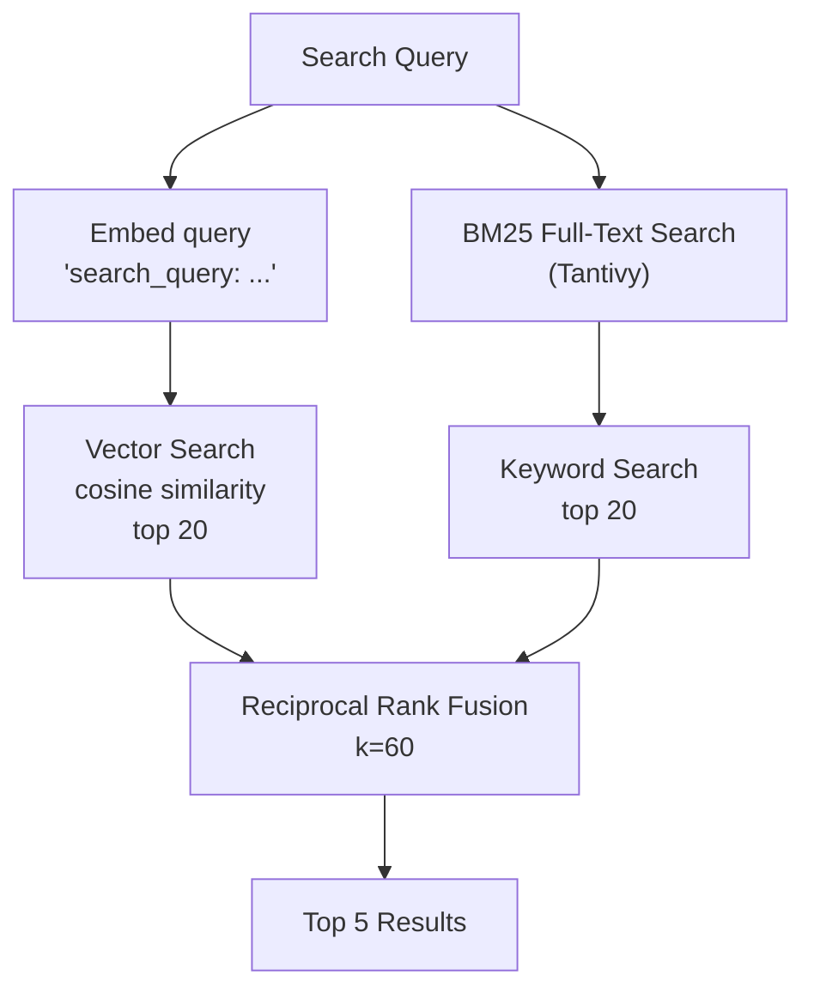
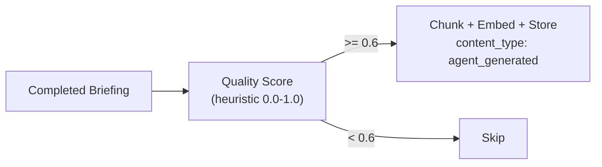
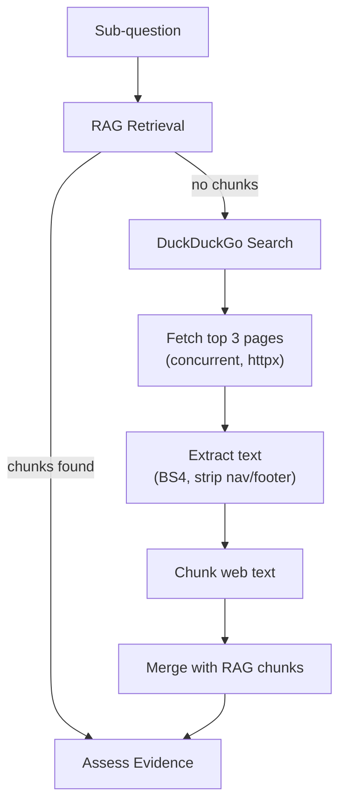
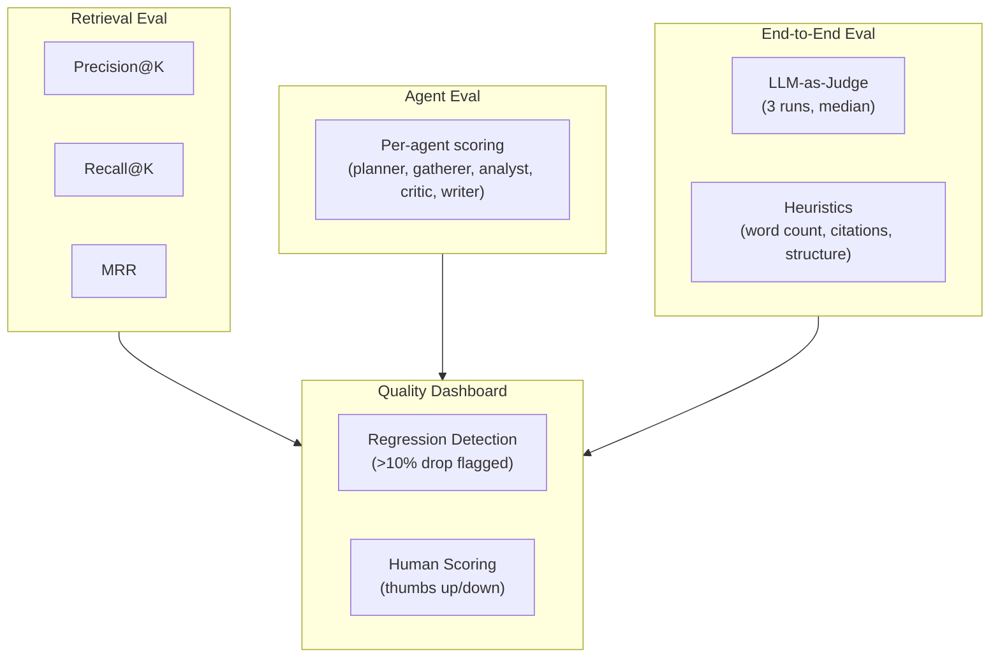

# ResearchForge

A local-first, multi-agent research analyst platform powered by [Ollama](https://ollama.com). Ingest your documents, ask research questions, and receive comprehensive sourced briefings — all running on your own hardware.

ResearchForge orchestrates five specialized LLM agents through a [LangGraph](https://github.com/langchain-ai/langgraph) pipeline: a **Planner** decomposes your question, a **Gatherer** retrieves evidence from your corpus (with web search fallback), an **Analyst** synthesizes findings, a **Critic** reviews for quality, and a **Writer** produces the final Markdown briefing.



---

## Table of Contents

- [Features](#features)
- [Architecture](#architecture)
- [Quick Start](#quick-start)
- [Usage](#usage)
- [Agent Pipeline](#agent-pipeline)
- [RAG System](#rag-system)
- [Web Search Fallback](#web-search-fallback)
- [Configuration](#configuration)
- [MCP Server](#mcp-server)
- [Evaluation Engine](#evaluation-engine)
- [Project Structure](#project-structure)
- [Development](#development)
- [License](#license)

---

## Features

- **Fully local** — runs entirely on consumer hardware with Ollama; no API keys needed
- **Multi-agent pipeline** — 5 specialized agents with critic revision loop
- **Hybrid RAG** — vector + BM25 search fused via Reciprocal Rank Fusion
- **Web search fallback** — DuckDuckGo fills gaps when the local corpus falls short
- **Multiple formats** — ingest PDF, Markdown, HTML, DOCX, and plain text
- **Real-time UI** — FastAPI + HTMX dashboard with SSE streaming progress
- **MCP integration** — expose tools to Claude Desktop via Model Context Protocol
- **Corpus feedback loop** — high-quality briefings are automatically re-ingested as knowledge
- **Eval engine** — retrieval metrics, LLM-as-judge scoring, model benchmarking, regression detection
- **GPU accelerated** — NVIDIA Container Toolkit passthrough for fast inference
- **Dockerized** — two-container stack (app + ollama), single `docker compose up`

---

## Architecture



| Component | Technology | Purpose |
|-----------|-----------|---------|
| Agent orchestration | LangGraph (StateGraph) | 5-node pipeline with conditional routing |
| Vector store | LanceDB (embedded) | Hybrid search: vector + BM25 via Tantivy FTS |
| Embeddings | nomic-embed-text (768-dim) | Document and query embedding via Ollama |
| Metadata DB | SQLite via aiosqlite | Document tracking, briefing history, chunk lineage |
| Web UI | FastAPI + Jinja2 + HTMX | Real-time dashboard with SSE streaming |
| MCP server | Python MCP SDK (FastMCP) | 6 tools for Claude Desktop integration |
| Document parsing | pymupdf4llm, mammoth, BS4 | PDF, DOCX, HTML, Markdown, TXT |
| Web search | duckduckgo-search + httpx | Fallback evidence when corpus has gaps |
| Logging | structlog (JSON lines) | Structured, machine-readable logs |
| Config | Pydantic Settings + YAML | Typed config with environment variable overrides |

---

## Quick Start

### Prerequisites

- Docker and Docker Compose
- NVIDIA GPU + [NVIDIA Container Toolkit](https://docs.nvidia.com/datacenter/cloud-native/container-toolkit/latest/install-guide.html) (recommended; CPU-only also supported)
- ~32 GB VRAM for the full model set, or ~16 GB with fallback models

### 1. Clone and start

```bash
git clone https://github.com/chrisfauerbach/researchforge.git
cd researchforge

# GPU (default)
docker compose up -d

# CPU-only (no NVIDIA GPU)
docker compose -f docker-compose.yml -f docker-compose.cpu.yml up -d
```

### 2. Pull models (first run only, ~30 GB)

```bash
docker compose exec ollama bash /scripts/setup_models.sh
```

This pulls all six models:

| Model | Size | Role |
|-------|------|------|
| deepseek-r1:14b | ~9 GB | Planner |
| qwen2.5:7b | ~4.5 GB | Gatherer (+ all fallbacks) |
| qwen2.5:14b | ~9 GB | Analyst, Eval Judge |
| deepseek-r1:7b | ~4.5 GB | Critic |
| mistral-nemo:12b | ~7 GB | Writer |
| nomic-embed-text | ~275 MB | Embeddings |

### 3. Open the dashboard

Navigate to **http://localhost:8000** in your browser.

### 4. Ingest documents (optional)

```bash
# Single file
docker compose exec app python -m researchforge ingest /app/data/sample_docs/paper.pdf

# Entire directory
docker compose exec app python -m researchforge ingest /app/data/sample_docs/
```

### 5. Ask a research question

Via the web UI, or via CLI:

```bash
docker compose exec app python -m researchforge research "What are the main approaches to retrieval-augmented generation?" --verbose
```

---

## Usage

### CLI Commands

```bash
# Ingest documents into the corpus
python -m researchforge ingest <path>

# Search the corpus
python -m researchforge search "query" --limit 5

# Run a research pipeline
python -m researchforge research "question" --depth standard --verbose

# Start the web server
python -m researchforge serve --reload

# Start the MCP server (stdio transport)
python -m researchforge mcp

# Run the evaluation suite
python -m researchforge eval run --skip-e2e

# Benchmark models for an agent role
python -m researchforge eval benchmark --role analyst --models "qwen2.5:14b,phi4:14b"
```

### Web UI

The dashboard at `http://localhost:8000` provides:

- **Research** — submit questions and watch the pipeline progress in real-time via SSE
- **Briefings** — browse completed briefings with rendered Markdown and source citations
- **Corpus** — search your document corpus and upload new files
- **Eval** — view evaluation scores, human feedback, and regression alerts

### Pipeline Depth Modes

| Mode | Agents | Use case |
|------|--------|----------|
| `standard` | Planner → Gatherer → Analyst → Critic → Writer | Thorough research with quality review |
| `quick` | Planner → Gatherer → Analyst → Writer | Faster results, skips critic review |

---

## Agent Pipeline

The research pipeline is a LangGraph `StateGraph` with five agent nodes and conditional routing:



### Agent Details

| Agent | Model (32 GB) | Input | Output |
|-------|--------------|-------|--------|
| **Planner** | deepseek-r1:14b | Research question | Sub-questions with priorities and info needs |
| **Gatherer** | qwen2.5:7b | Sub-questions | Retrieved evidence chunks + relevance assessments |
| **Analyst** | qwen2.5:14b | Evidence + gaps | Synthesized findings with cross-references |
| **Critic** | deepseek-r1:7b | Analysis | Verdict (`pass`/`revise`) + issues list |
| **Writer** | mistral-nemo:12b | Analysis + caveats | Final Markdown briefing with citations |

Every agent has a fallback model (`qwen2.5:7b`) that activates automatically on timeout or error — the pipeline degrades gracefully rather than failing.

### Pipeline State

Each run maintains a `PipelineState` that flows through all agents:



State includes: `research_plan`, `evidence`, `gaps`, `analysis`, `critic_verdict`, `critic_issues`, `revision_count`, `briefing`, `trace` (per-agent timing and token counts), and `errors`.

---

## RAG System

### Document Ingestion Flow



**Parsing** extracts clean text from each format — PDFs are converted to Markdown (preserving structure), DOCX via mammoth, HTML via BeautifulSoup tag stripping.

**Chunking** uses a two-pass strategy:
1. `MarkdownHeaderTextSplitter` — preserves section boundaries (for PDF/Markdown with headers)
2. `RecursiveCharacterTextSplitter` — enforces size limits (1500 chars, 200 overlap)

Section metadata (`section_h1`, `section_h2`) is preserved through to retrieval, so citations include both source file and section.

### Hybrid Retrieval



Retrieval runs both vector similarity and BM25 keyword search in parallel, then fuses rankings with RRF. This catches both semantically similar and keyword-matching chunks — each approach compensates for the other's blind spots.

### Corpus Feedback Loop

High-quality briefings are automatically re-ingested into the corpus:



Quality scoring considers word count, citation presence, section structure, pipeline errors, and critic verdict. Re-ingested briefings are tagged `content_type: "agent_generated"` and can be excluded from retrieval with `source_only=True`.

---

## Web Search Fallback

When the local corpus lacks relevant documents, the Gatherer agent can search the web:



| Mode | Behavior |
|------|----------|
| `auto` (default) | Search web only when RAG returns zero chunks |
| `always` | Search web for every sub-question alongside RAG |
| `disabled` | Never search the web |

Web chunks are ephemeral (in-memory only, never stored in LanceDB) and flow through the existing evidence pipeline with `source_type: "web"` attribution.

Configure via environment variable:
```bash
RESEARCHFORGE_WEB_SEARCH__MODE=disabled  # or auto, always
```

---

## Configuration

ResearchForge uses a layered config system: `config.yaml` defaults, overridden by environment variables.

### Environment Variables

All settings can be overridden with the `RESEARCHFORGE_` prefix and `__` delimiter for nesting:

```bash
RESEARCHFORGE_OLLAMA__BASE_URL=http://ollama:11434
RESEARCHFORGE_MODELS__PLANNER=qwen2.5:7b
RESEARCHFORGE_WEB_SEARCH__MODE=disabled
RESEARCHFORGE_PIPELINE__MAX_CRITIC_RETRIES=3
RESEARCHFORGE_RETRIEVAL__FINAL_TOP_K=10
```

### config.yaml Reference

```yaml
ollama:
  base_url: "http://ollama:11434"
  request_timeout_seconds: 120
  keep_alive: "5m"

models:
  planner: "deepseek-r1:14b"
  gatherer: "qwen2.5:7b"
  analyst: "qwen2.5:14b"
  critic: "deepseek-r1:7b"
  writer: "mistral-nemo:12b"
  embedding: "nomic-embed-text"
  fallbacks:
    planner: "qwen2.5:7b"
    analyst: "qwen2.5:7b"
    critic: "qwen2.5:7b"
    writer: "qwen2.5:7b"

chunking:
  chunk_size: 1500       # ~375 tokens
  chunk_overlap: 200     # ~50 tokens

retrieval:
  vector_candidates: 20
  bm25_candidates: 20
  final_top_k: 5

pipeline:
  max_critic_retries: 2
  quality_threshold_for_corpus: 0.6

web_search:
  mode: "auto"           # auto | always | disabled
  max_results: 3
  max_page_chars: 8000
  fetch_timeout_seconds: 15

storage:
  data_dir: "./data"
  vector_db_path: "./data/lancedb"
  metadata_db_path: "./data/metadata.db"

web:
  host: "0.0.0.0"
  port: 8000

mcp:
  transport: "stdio"
```

### 16 GB Fallback

For machines with 16 GB VRAM, set all roles to the 7B fallback:

```bash
RESEARCHFORGE_MODELS__PLANNER=qwen2.5:7b
RESEARCHFORGE_MODELS__ANALYST=qwen2.5:7b
RESEARCHFORGE_MODELS__CRITIC=qwen2.5:7b
RESEARCHFORGE_MODELS__WRITER=qwen2.5:7b
```

---

## MCP Server

ResearchForge exposes six tools via the [Model Context Protocol](https://modelcontextprotocol.io) for Claude Desktop integration:

| Tool | Description |
|------|-------------|
| `research(topic, depth)` | Launch a research pipeline, returns job ID |
| `get_status(job_id)` | Check pipeline status and retrieve results |
| `query_corpus(query, limit)` | Hybrid search over the document corpus |
| `ingest_document(file_path)` | Ingest a file into the corpus |
| `list_briefings(limit, status)` | List completed briefings |
| `get_briefing(briefing_id)` | Retrieve a full briefing by ID |

### Claude Desktop Setup

Add to your Claude Desktop config (`claude_desktop_config.json`):

```json
{
  "mcpServers": {
    "researchforge": {
      "command": "/path/to/researchforge/scripts/mcp_wrapper.sh"
    }
  }
}
```

The wrapper script auto-detects a local `.venv` or falls back to Docker Compose.

---

## Evaluation Engine

### Eval Suite

```bash
# Run full evaluation
docker compose exec app python -m researchforge eval run

# Skip slow end-to-end tests
docker compose exec app python -m researchforge eval run --skip-e2e

# Benchmark models head-to-head
docker compose exec app python -m researchforge eval benchmark --role analyst --models "qwen2.5:14b,phi4:14b"
```

### Metrics



**LLM-as-Judge rubric** (weighted):

| Criterion | Weight |
|-----------|--------|
| Relevance | 0.30 |
| Completeness | 0.25 |
| Coherence | 0.20 |
| Structural validity | 0.15 |
| Conciseness | 0.10 |

Results are stored as JSONL in `eval/results/` and displayed on the eval dashboard at `/eval`. Regression detection compares each run against a rolling average of the last 5 runs and flags any metric drop exceeding 10%.

---

## Project Structure

```
researchforge/
├── docker-compose.yml               # GPU stack (app + ollama)
├── docker-compose.cpu.yml           # CPU-only override
├── Dockerfile                       # App image (Python 3.12-slim)
├── config.yaml                      # Default configuration
├── pyproject.toml                   # Dependencies and tool config
│
├── src/researchforge/
│   ├── __main__.py                  # CLI (ingest, search, research, serve, mcp, eval)
│   ├── config.py                    # Pydantic Settings + YAML loader
│   │
│   ├── agents/                      # Multi-agent pipeline
│   │   ├── graph.py                 # LangGraph StateGraph definition
│   │   ├── state.py                 # PipelineState TypedDict
│   │   ├── planner.py              # Planner agent
│   │   ├── gatherer.py             # Gatherer agent (RAG + web search)
│   │   ├── analyst.py              # Analyst agent
│   │   ├── critic.py               # Critic agent
│   │   ├── writer.py               # Writer agent
│   │   ├── ollama_client.py        # LLM client with fallback + retry
│   │   └── prompts/*.txt           # Agent prompt templates
│   │
│   ├── rag/                         # Retrieval-Augmented Generation
│   │   ├── parsers.py              # PDF, Markdown, HTML, DOCX, TXT
│   │   ├── chunker.py             # Two-pass chunking strategy
│   │   ├── embeddings.py          # Ollama embedding client
│   │   ├── store.py               # LanceDB wrapper (vector + FTS)
│   │   ├── retriever.py           # Hybrid search with RRF
│   │   ├── ingest.py              # Ingestion orchestration + dedup
│   │   ├── feedback.py            # Corpus feedback loop
│   │   └── web_search.py          # DuckDuckGo fallback
│   │
│   ├── web/                         # Web application
│   │   ├── app.py                  # FastAPI factory + lifespan
│   │   ├── events.py              # SSE event bus
│   │   ├── routes/                # research, briefings, corpus, eval
│   │   ├── templates/             # Jinja2 HTML templates
│   │   └── static/               # HTMX, CSS
│   │
│   ├── mcp_server/
│   │   └── server.py              # FastMCP with 6 tools
│   │
│   ├── eval/                        # Evaluation engine
│   │   ├── retrieval_eval.py      # Precision, Recall, MRR
│   │   ├── judge.py               # LLM-as-Judge + heuristics
│   │   ├── agent_eval.py          # Per-agent evaluation
│   │   ├── e2e_eval.py            # End-to-end benchmarking
│   │   ├── benchmark.py           # Model comparison
│   │   └── runner.py              # Orchestration + regression detection
│   │
│   └── db/
│       ├── models.py              # Table schemas
│       └── repository.py          # Async SQLite access
│
├── scripts/
│   ├── setup_models.sh            # Pull all Ollama models
│   └── mcp_wrapper.sh             # Claude Desktop MCP wrapper
│
├── eval/
│   ├── datasets/                  # Test cases (JSONL)
│   └── results/                   # Eval scores (JSONL, append-only)
│
├── tests/                           # pytest (246 tests)
│   ├── test_agents/
│   ├── test_rag/
│   ├── test_web/
│   ├── test_eval/
│   └── test_mcp/
│
├── data/                            # Runtime data (Docker volume)
│   ├── lancedb/                   # Vector store files
│   └── metadata.db                # SQLite database
│
└── logs/                            # Structured JSON logs
```

---

## Development

### Local Setup (without Docker)

```bash
python3.12 -m venv .venv
source .venv/bin/activate
pip install -e ".[dev]"
```

Requires a running Ollama instance at `http://localhost:11434`:

```bash
export RESEARCHFORGE_OLLAMA__BASE_URL=http://localhost:11434
```

### Running Tests

```bash
# All tests (246)
.venv/bin/python -m pytest tests/ -v

# Skip tests that require a running Ollama instance
.venv/bin/python -m pytest tests/ -v -m "not ollama"

# Specific test module
.venv/bin/python -m pytest tests/test_agents/test_gatherer.py -v
```

### Linting

```bash
.venv/bin/python -m ruff check src/ tests/
.venv/bin/python -m ruff check --fix src/ tests/
```

### Useful Docker Commands

```bash
docker compose logs -f app          # Tail app logs
docker compose exec app bash        # Shell into app container
docker compose exec ollama ollama list  # List loaded models
docker compose down                 # Stop (data persists)
docker compose down -v              # Stop + delete model volume
```

---

## License

MIT
